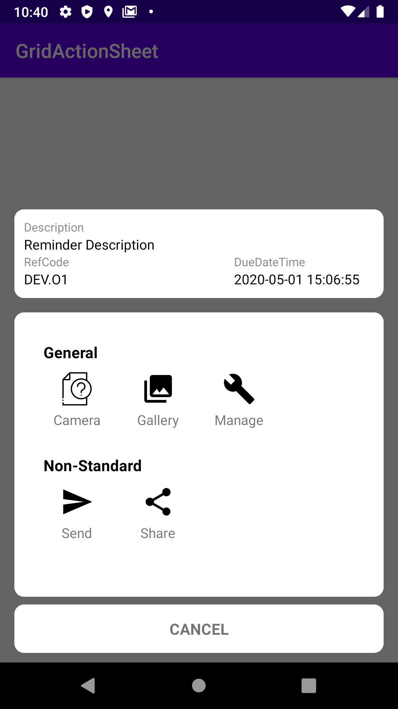
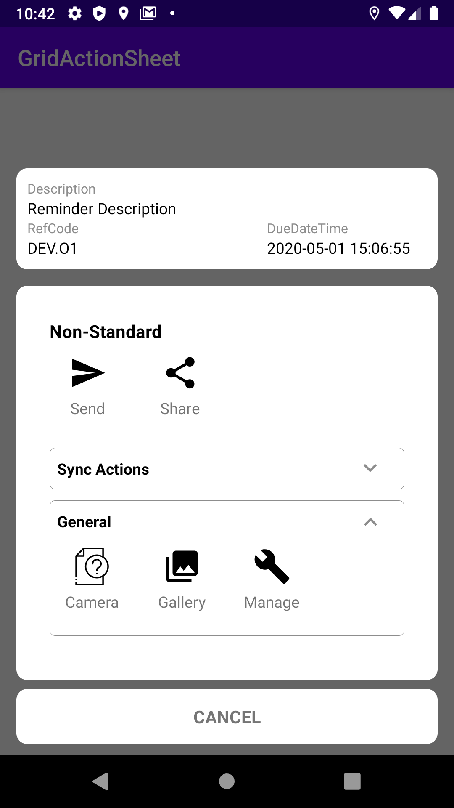

# Grid ActionSheet  

Android ActionSheet with actions as GridView.

### What's Included
- Easy Integration.
- Integrate in less than 5 minutes.
- Uses AndroidX artifacts.
- Easily customizable.

### Preview

##### 1 - Standard Grid ActionSheet


##### 2 - Grouped Actions


##### 3 - Grouped Actions with Expandable



### Setup

**Step 1.**  Add the JitPack repository to your build file

Add it in your root build.gradle at the end of repositories:

```css
	allprojects {
		repositories {
			...
			maven { url 'https://jitpack.io' }
		}
	}
```

**Step 2.**  Add the dependency

```css
	dependencies {
	        implementation 'com.github.bismarabia:grid-actionsheet:${lastestVersion}'
	}
```

### Usage

Add this to you activity class.
```java

@Override  
protected void onCreate(Bundle savedInstanceState) {  
    super.onCreate(savedInstanceState);  
	ActivityMainBinding activityMainBinding = DataBindingUtil.inflate(LayoutInflater.from(this), R.layout.activity_main, null, false);  
    setContentView(activityMainBinding.getRoot());  
  
    ActionSheetBuilder actionSheetBuilder = new ActionSheetBuilder(this)  
            // default action's icon if not defined.  
            .withDefaultActionIcon(R.drawable.ico_unknown_black_24dp)  
  
            // if you want to use group actions  
			.withGroupedActions(new ArrayList<ActionGroup>() {{  
  
	            // 1st group.  
				add(new ActionGroup("Sync Actions", new ArrayList<Action>() {{  
	                    add(new Action(3, getResources().getDrawable(R.drawable.ic_menu_send), "Send"));  
						add(new Action(4, getResources().getDrawable(R.drawable.ic_menu_share), "Share")); 						
				}}).withEnableExpandable(true));  
	  
				// 2nd group.  
				  add(  
		             new ActionGroup("General", new ArrayList<Action>() {{  
			             add(new Action(0, 0, "Camera"));  
						 add(new Action(1, getResources().getDrawable(R.drawable.ic_menu_gallery), "Gallery"));  
						 add(new Action(2, getResources().getDrawable(R.drawable.ic_menu_manage), "Manage"));  
					  }})  
		              // enable expandable  
					  .withEnableExpandable(true)  
		              // expand at start.  
		              .withExpandedOnStart(true)  
		         );  
	  
				 // 3rd group.  
				 add(new ActionGroup("Non-Standard", new ArrayList<Action>() {{  
		             add(new Action(3, getResources().getDrawable(R.drawable.ic_menu_send), "Send"));  
					 add(new Action(4, getResources().getDrawable(R.drawable.ic_menu_share), "Share"));  
				 }}));  
		    }})  
  
            // or use normal grid ActionSheet.  
            .withActions(new ArrayList<Action>() {{  
              add(new Action(0, 0, "Camera"));  
			  add(new Action(1, getResources().getDrawable(R.drawable.ic_menu_gallery), "Gallery"));  
			  add(new Action(2, getResources().getDrawable(R.drawable.ic_menu_manage), "Manage"));  
			  add(new Action(3, getResources().getDrawable(R.drawable.ic_menu_send), "Send"));  
			  add(new Action(4, getResources().getDrawable(R.drawable.ic_menu_share), "Share"));  
			}})  
  
            // if true, place groups with expandable at the bottom.  
		    .putExpandableAtTheEnd(true)  
  
            // callback that provides groupAction adapter  
		    .withGroupActionAdapterListener(aActionGroupAdapter -> {

			})  
  
            // callback that provides Actions adapter  
		    .withActionAdapterListener(aActionAdapter -> {

		    })  
		   
		    // add extra layout on top of the ActionSheet.  
            .withExtraView(R.layout.layout_extra, aInflate -> {
		  
		    })  
		  
		    // handle click event on the actions if not specified in the actions definition.  
		    .withActionsClickListener(aId -> {  
		      // handle item click event.  
		    });  
		  
		  
		    activityMainBinding.btnShowActionSheet.setOnClickListener(v -> {  
	            // show ActionSheet.  
			    actionSheetBuilder.show();  
		    });  
	}
}
```

### Font Icons Support
Added support to custom font icons using [Android-Icons](https://github.com/mikepenz/Android-Iconics) is introduced in version 1.1.0
```java
	new Action(0, FontAwesome.Icon.faw_android, "Font Awesome Icon");
	new Action(1, GoogleMaterial.Icon.gmd_favorite, "Google Material Icon");
	new Action(2, YourCustomFont.Icon.custom_icon, "Custom Font Icon");
	...
```

### Developed By
-	Rabia Abismail
-	Software Engineer.

### Community
If you have any issue regarding this library, or if you have any suggestion please open an [issue](https://github.com/bismarabia/grid-actionSheet/issues/new) and lemme know.
